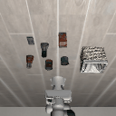
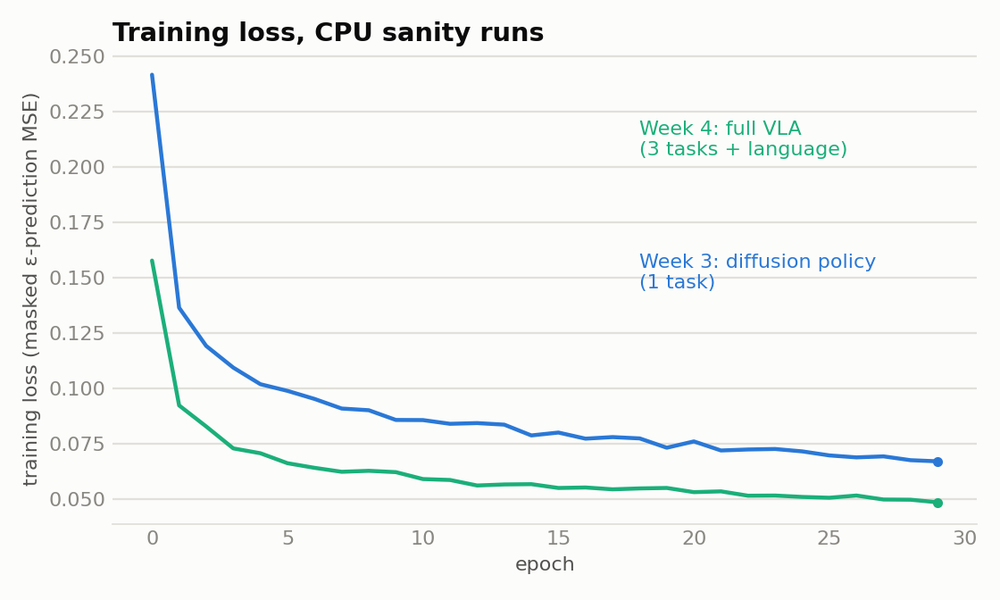
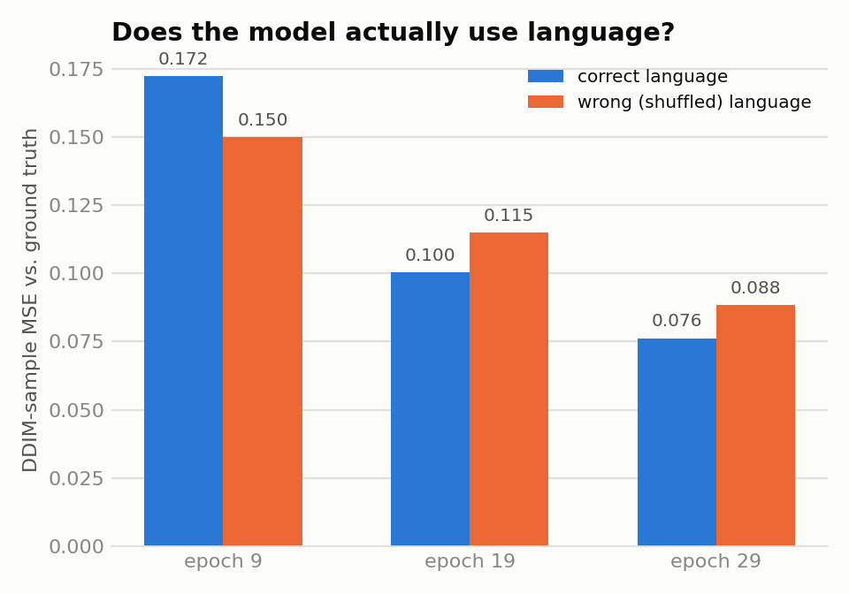
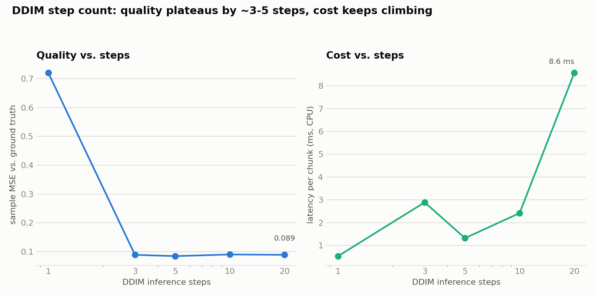
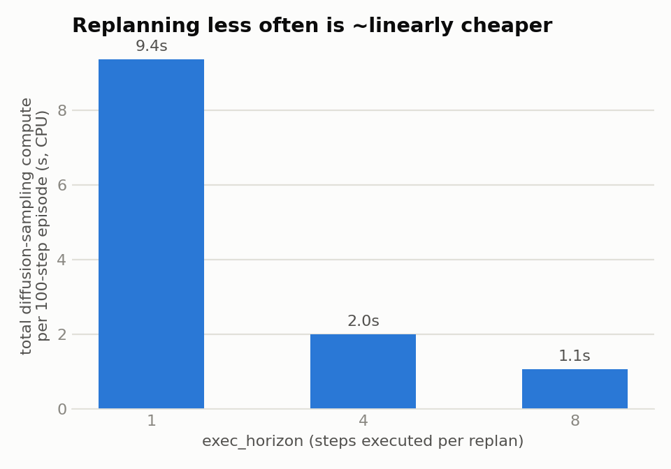

# vla-diffusion-libero

A small, from-scratch language-conditioned VLA: frozen CLIP vision+text embeddings feed a
learned fusion transformer, which conditions a diffusion-transformer action head via FiLM.
Trained and evaluated on [LIBERO](https://github.com/Lifelong-Robot-Learning/LIBERO) in
simulation. Architecturally this is a scaled-down version of what pi0 / RDT-1B / Octo do
(VLM conditioning + diffusion-policy action decoding) — the goal is to demonstrate the ability
to actually build this combination end-to-end, not just fine-tune an existing checkpoint or
benchmark two off-the-shelf baselines against each other.



*A trained checkpoint driving the real robosuite/MuJoCo sim in closed loop — live CLIP
encoding, language-conditioned diffusion sampling, receding-horizon control. This particular
checkpoint is a 30-epoch CPU sanity run (see [Results](#results) for why that matters and what
it doesn't yet do); the point of this GIF is that the full pipeline runs correctly end-to-end.*

## Why this project

Built for a robot-learning-engineer application, specifically to demonstrate: implementing a
diffusion policy and a VLA from the underlying papers rather than only running existing repos;
data debugging (dataset inspection, failure-mode flagging, metric design); and running/reading
ablations and communicating the tradeoffs honestly, including where the results are weak and why.

## Architecture

```
RGB (agentview cam)          -> frozen vision encoder (CLIP ViT-B/32, openai weights)  -+
Language instruction         -> frozen text encoder (CLIP text tower)                  -+-> fusion transformer (learned, self-attention over 4 pooled tokens + CLS)
Proprioception (joint/eef/gripper, 15-dim) -----------------------------------------    -+       |
                                                                                                   v
                                                                                     conditioning vector z
                                                                                                   |
                                                                            FiLM conditioning      v
                                                                    diffusion action head (1D residual conv stack)
                                                                    - DDPM eps-prediction loss on 8-step action chunks
                                                                    - DDIM sampling (~3-5 steps is enough, see Results)
                                                                    - classifier-free guidance on language
```

Vision/language backbones are frozen and their embeddings are precomputed/cached offline —
training only updates the fusion transformer + diffusion head (~a few million params). This is
the main lever that keeps this trainable on a single rented GPU in hours, not days.

## Results

**Read this before the numbers below**: all results here come from CPU-only sanity-scale
training runs (≤30 epochs, 3 tasks, 50 demos/task, no image augmentation) done on a laptop with
no GPU, deliberately kept cheap per this project's compute plan — real training is reserved for
a rented GPU. What these runs demonstrate is that the *pipeline* (data → training → closed-loop
eval → ablations) is fully correct end-to-end; the *policy* itself is not yet good, and that's
expected, not a bug.

### Training actually learns



Week 3's diffusion-only policy (1 task) and Week 4's full VLA (3 tasks + language) both show
clean, monotonic loss curves — unsurprising on its own, but it's the baseline sanity check
everything else depends on.

### The model is actually using language, not shortcutting through vision



LIBERO-Object's tasks all share the *identical* shelf scene — every task's demo shows the same
objects in the same layout; only the language instruction says which one to pick. That makes
this a clean test: sample an action chunk conditioned on the *correct* instruction vs. a
*wrong* one (shuffled from a different task in the batch) and compare to ground truth. If the
model were ignoring language, there'd be no difference. Early in training there wasn't (epoch
9: wrong-language MSE was even slightly *lower*, i.e. noise). By epoch 19 the expected direction
emerged and held through epoch 29 — a genuine, if modest, cross-modal effect.

### DDIM step count: diminishing returns kick in fast



Sampling quality (chunk MSE against held-out ground-truth actions) falls off a cliff below 3
steps, then flattens through 20. Practically: this policy doesn't need the 100 steps it trained
with — 3-5 DDIM steps captures almost all the achievable quality, which is most of the
latency gap against a single-forward-pass VLA that a diffusion policy is usually criticized for.

*(A parallel sweep over classifier-free-guidance scale showed no consistent effect on this
metric at this training budget — reported as inconclusive rather than oversold; 30 epochs on 3
tasks is likely too little training for the unconditional branch to have learned a meaningfully
different distribution yet.)*

### Replanning frequency: a real compute/reactivity tradeoff



`exec_horizon` controls how many actions from a sampled chunk get executed open-loop before the
policy replans. Total diffusion-sampling compute per episode scales roughly linearly with
replanning frequency — about a 9x difference between replanning every step and replanning once
per full chunk. The other side of this tradeoff (does replanning less often hurt success once
drift accumulates) isn't visible yet because closed-loop success is 0% at every setting with
this checkpoint — see below.

### Headline closed-loop number: 0/45 successes

Across all 3 trained tasks × all 3 `exec_horizon` settings × 5 episodes. Expected, not
concerning, given 50 demos/task and 30 CPU epochs with no augmentation — the harder engineering
problem this week solved was getting the *full* closed-loop path (live CLIP encoding → fusion
trunk → CFG-guided DDIM sampling → receding-horizon control → real sim execution → success
detection) to run correctly at all, which it now does. All plots and numbers are reproducible
via `scripts/ablate_ddim_cfg.py` and `scripts/ablate_exec_horizon.py`.

## Repo layout

```
src/vla_diffusion/
  data/       LIBERO dataset wrappers, CLIP embedding caching, action normalization
  models/     CLIP encoder wrapper, fusion transformer, diffusion action head, BC-MLP baseline
  training/   train loops (BC-MLP, diffusion-only, full VLA), shared losses/data-utils
  eval/       closed-loop rollout harnesses (BC-MLP and VLA), shared sim/proprio utilities
  ros2/       reference ROS2 node wrapping the trained policy for real-robot deployment
scripts/
  setup_libero.sh              clone + install LIBERO into the uv venv, non-interactive config
  download_libero_data.py      pull a task subset (not the whole suite) from Hugging Face
  inspect_libero_data.py       data-debugging pass: episode lengths, action stats, outlier flags
  precompute_clip_embeddings.py cache frozen CLIP embeddings for a set of task files
  ablate_ddim_cfg.py           open-loop DDIM-steps / CFG-scale ablation
  ablate_exec_horizon.py       closed-loop replanning-frequency ablation
  make_plots.py                regenerates the plots in assets/plots/
assets/       committed plots + demo GIF for this README
```

## Setup

```bash
uv sync                        # installs the pinned project deps into .venv
scripts/setup_libero.sh        # clones LIBERO, installs it into .venv, seeds non-interactive config
export LIBERO_CONFIG_PATH="$(pwd)/.libero_config"   # add to shell profile too
export MUJOCO_GL=egl                                # headless rendering

# pull a small task subset instead of the full 7.5GB suite
uv run python scripts/download_libero_data.py --suite libero_object --num-tasks 3

# data-debugging pass on a downloaded task
uv run python scripts/inspect_libero_data.py --file data/libero_datasets/libero_object/<task>_demo.hdf5

# cache frozen CLIP embeddings (training never re-runs CLIP's forward pass)
uv run python scripts/precompute_clip_embeddings.py \
    --data data/libero_datasets/libero_object/*.hdf5 --cache-dir data/clip_cache

# train the full VLA, multi-task + language-conditioned
uv run python -m vla_diffusion.training.train_vla \
    --data data/libero_datasets/libero_object/*.hdf5 --clip-cache-dir data/clip_cache \
    --outdir outputs/vla_run1 --epochs 100

# closed-loop eval in the real sim
uv run python -m vla_diffusion.eval.rollout_vla \
    --checkpoint outputs/vla_run1/ema.pt --task-name <task_substring>

# ablations
uv run python scripts/ablate_ddim_cfg.py --checkpoint outputs/vla_run1/ema.pt
uv run python scripts/ablate_exec_horizon.py --checkpoint outputs/vla_run1/ema.pt
```

Note: `torch` pulls the standard PyPI CUDA-enabled Linux wheel by default, so no separate
reinstall should be needed on a rented GPU box as long as its driver supports the installed
CUDA version. If `torch.cuda.is_available()` is `False` there, reinstall with an `--index-url`
matching that box's driver (see pytorch.org's install matrix).

## ROS2 wrapper

`src/vla_diffusion/ros2/vla_policy_node.py` wraps the trained policy as a standard `rclpy.Node`:
subscribes to a camera image topic and `/joint_states` (+ a `tf2` lookup for end-effector pose,
matching how real Franka-Panda ROS2 drivers expose robot state), runs the same live-CLIP →
fusion-trunk → CFG-guided-DDIM-sampling → receding-horizon loop as `eval/rollout_vla.py`, and
publishes the resulting action. It's written against the standard ROS2 Humble/Jazzy `rclpy` API
but **not run against a live ROS2 stack** — this sandbox has no ROS2 install (`rclpy` isn't a
pip package; it ships with a ROS2 distro's own Python environment, so this project's deps would
need to be made importable from that same interpreter). Treat it as correct, adaptable reference
code, not a validated one — see the notes at the bottom of the file for what to check on a real
ROS2 box before trusting it near a robot.

## Compute-minimized MVP scope

Full LIBERO-Object is 10 tasks × 50 demos (~7.5GB, one ~700-800MB hdf5 per task). This project
trains on a **3-task subset** (~2GB) with cached frozen embeddings and a small action head.
Scale up to the full suite only after the pipeline is validated end-to-end — which, per the
Results section above, it now is.

## Gotchas hit while building this (kept here since they cost real debugging time)

- **LIBERO's editable install silently installs nothing.** Its `libero/` package dir has no
  top-level `__init__.py`, so `pip install -e .`'s default PEP 660 finder registers an empty
  package map (`import libero` fails with no error at install time). Fixed by installing with
  `--config-settings editable_mode=compat`, which falls back to a plain sys.path insertion.
- **robosuite>=1.5 breaks LIBERO's imports outright** — `single_arm_env.py` was renamed to
  `manipulation_env.py`. Pinned to `robosuite==1.4.1`, the version LIBERO's own (very stale)
  `requirements.txt` targets.
- **robosuite 1.4.1 + a modern mujoco crashes at `env.reset()`** with a `TypeError` in
  `mj_fullM()` — the C binding signature changed. Pinned `mujoco==3.1.6`, contemporaneous with
  robosuite 1.4.1's release; verified working end-to-end (reset/step/closed-loop rollout).
- **`bddl`, `robomimic`, `gym`, `future`, `easydict`, `cloudpickle`, `thop` are all real runtime
  imports** in LIBERO's code that its `setup.py` declares zero dependencies for. Found by
  actually running the pipeline and fixing each `ModuleNotFoundError` as it surfaced, then
  pinned individually with `--no-deps` so their own stale transitive pins (e.g. `numpy==1.22.4`)
  don't clobber the modern stack the rest of this project depends on.
- **A stray `VIRTUAL_ENV` env var from an unrelated project silently redirects `uv pip
  install`** to the wrong virtualenv (`uv add` ignores it and warns; `uv pip install` obeys it
  with no warning). `unset VIRTUAL_ENV` before any `uv pip` command in this repo.
- **A "fuller" 100-epoch training attempt on this same CPU machine had to be killed after 218
  minutes with no visible progress** — the machine turned out to be an actively-used desktop,
  not a dedicated box, and the job's CPU share dropped from ~840% to ~250% under real desktop
  load with no way to tell how far it had gotten (Python fully buffers stdout when redirected to
  a file). Correct call was to stop burning desktop CPU chasing a result the training budget was
  never going to make strong anyway, and use the already-validated 30-epoch checkpoint instead.
  Training scripts now write `history.json` every epoch (not just at the end) specifically so
  a killed run still leaves plottable progress on disk.

## Status / roadmap

- [x] **Week 1** — LIBERO installed and verified; per-task download helper; data-inspection
      script validated on real data (flagged 5/50 episodes as length outliers)
- [x] **Week 2** — Chunked/normalized dataset; BC-MLP baseline trains and drives a real
      closed-loop rollout in the sim
- [x] **Week 3** — FiLM-conditioned diffusion action head (DDPM/DDIM via `diffusers`, EMA);
      single-task overfit sanity check confirms the sampling process learns, not just the loss
- [x] **Week 4** — Frozen-CLIP vision-language fusion trunk + classifier-free guidance,
      multi-task training; language-sensitivity check confirms real cross-modal conditioning
- [x] **Week 5** — Closed-loop VLA eval harness; DDIM-steps, CFG-scale, and exec-horizon
      ablations, all run against real data (see [Results](#results))
- [x] **Week 6** — Plots, rollout GIF, README polish, reference ROS2 wrapper
- [ ] **Week 7 (next)** — Real training run on a rented GPU: more epochs, the full 10-task
      suite, image augmentation. This is where the closed-loop success rate is expected to
      actually move off 0% — everything upstream of it is now validated and ready to point at it.
